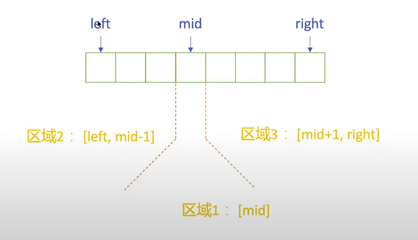
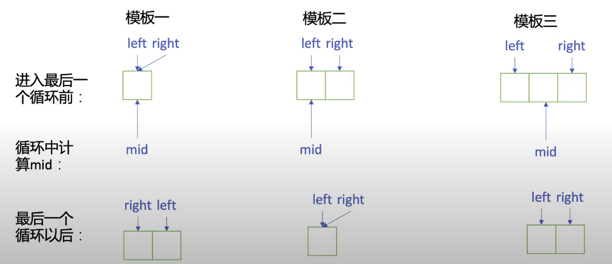

# Binary Search

## 3 Templates
### Basic
```go
func bs_basic(nums int[], target int) int {

    left, right := 0, len(nums) - 1 // Init State

    for left <= left { // End Cond: left > right

        mid := left + (right - left) >> 1

        if target == nums[mid] {
            return mid

        } else if nums[mid] < target { // Right Interval
            left = mid + 1

        } else {
            right = mid - 1  // Left Interval
        }

        return -1
    }
}
```
- Solution interval: `[left, right]`
- End condition: `left = right + 1` (interval: $\emptyset$)
- Usage: can determine the answer **only by `mid`**
- Characteristic:
  - init: `left, right = 0, len-1`
  - term: `left > right`
  - search right: `left = mid + 1`
  - search left: `right = mid - 1`



### right open
```go
func bs_right_open (nums int[], target int) int {
    left, right := 0, len(nums) // 🔴IS

    for left < right { // 🔴EC: left == right
        mid := left + (right - left) >> 1

        if nums[mid] == target {
            return mid

        } else if nums[mid] < target { // RI
            left = mid + 1

        } else { //  🔴LI
            right = mid
        }
    }

    // Post-processing:
    if left != len(nums) && // check: `left = mid + 1` equal to `len(nums) - 1`
       nums[left] == target { // check: the last ele is target or not.
        return left
    } else {
        return -1
    }
}
```
- Solution interval: `[left,`🔴`right)`
- End condition: 🔴`left == right` (interval: $\emptyset$)
- Usage: need determine the answer **by `right = mid` and `left = mid + 1`**
- Characteristic:
  - init: `left, right = 0`, 🔴`len`
  - term: `left` 🔴`==` `right`
  - search right: `left = mid + 1`
  - search left: `right = `🔴`mid`

### 2 open
```go
func bs_right_open (nums int[], target int) int {
    left, right := 0, len(nums) - 1 // IS

    for left + 1 < right { // 🔴EC: left + 1 == right
        mid := left + (right - left) >> 1

        if nums[mid] == target {
            return mid

        } else if nums[mid] < target { // 🔴RI
            left = mid 

        } else { // 🔴LI
            right = mid
        }
    }

    // Post-processing:
    switch target {
        case right:
            return right
        case left:
            return left
        default:
            return -1
    }
}
```
- Solution interval: 🔴`(left,`🔴`right)`
- End condition: 🔴`left == right` (interval: $\emptyset$)
- Usage: need determine the answer **by `right = mid` and `left = mid + 1`**
- Characteristic:
  - init: `left, right = 0, len`
  - term: `left` 🔴`==` `right`
  - search right: `left = `🔴`mid`
  - search left: `right = `🔴`mid`


### Comparison

