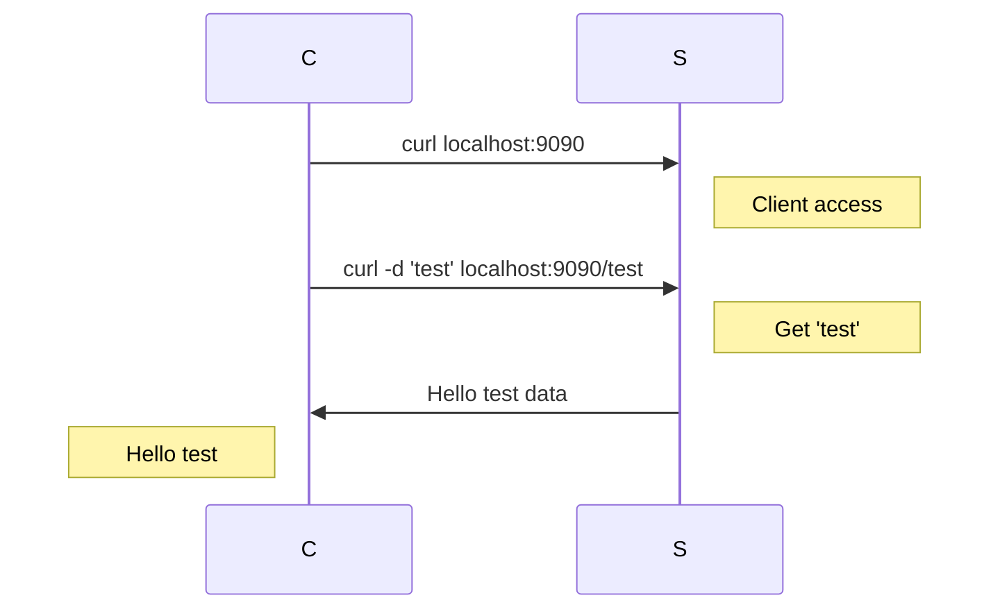

# 01 Introduction

## Project Structure
```go
.
├── main.go +
└── README.md +
```

## Run the code
- Server
```bash
$ go run main.go
```
- Client
```bash
$ curl localhost:9090
$ curl -d 'test' localhost:9090/test
```


## [http.HandleFunc](https://pkg.go.dev/net/http#HandleFunc)
```go
// Define
func HandleFunc(pattern string, handler func(ResponseWriter, *Request))

// Example: L18-L20
http.HandleFunc("/", func(w http.ResponseWriter, r *http.Request) {
    ...
})
```
Registers the `handler function` for the given pattern `/` in the [`DefaultServeMux`](https://pkg.go.dev/net/http#ServeMux), which explains how patterns are matched.

## [http.ListenAndServe](https://pkg.go.dev/net/http#ListenAndServe)
```go
// Define
func ListenAndServe(addr string, handler Handler) error

// Example: L43
http.ListenAndServe(":9090", nil)
```
Listen on the **TCP** network address `addr` and then calls Serve with the `handler` to handle requests on incoming connections.