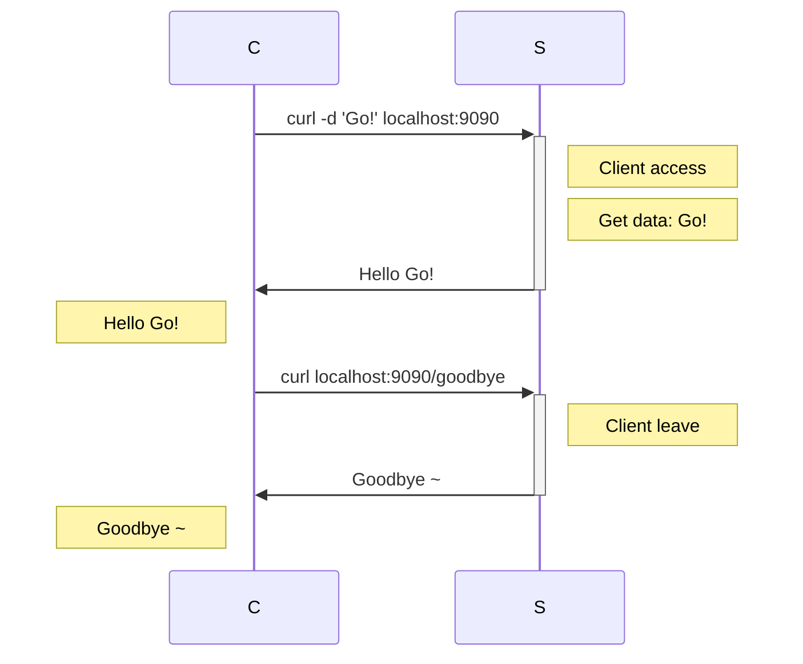

# 02 Introduction cont.

## Project Structure
```go
.
├── go.mod +
├── handlers +
│   ├── goodbye.go +
│   └── hello.go +
├── main.go *
└── README.md *
```

## Run the code
- Server
```bash
$ go run main.go
```
- Client
```bash
$ curl localhost:9090
$ curl localhost:9090/goodbye
```

## handlers
The **handlers** dir defines `HelloHandler` and `GoodbyeHandler` [Handler](https://pkg.go.dev/net/http#Handler) type.

A Handler responds to an HTTP request.
[ServeHTTP](https://pkg.go.dev/net/http#ServeHTTP) shoud be implement
```go
type Handler interface {
	ServeHTTP(ResponseWriter, *Request)
}

// The ServeHTTP function
func (f HandlerFunc) ServeHTTP(w ResponseWriter, r *Request)
```

### hello.go
- Define the `Hello` struct
```go
type Hello struct {
	l *log.Logger
}
```

- The factory pattern
```go
func NewHello(l *log.Logger) *Hello {
	return &Hello{l}
}
```

- Implement the `ServeHTTP` function
```go
func (h *Hello) ServeHTTP(w http.ResponseWriter, r *http.Request) {
	h.l.Println("Hello Go")

	// Read the request body
	if d, err := ioutil.ReadAll(r.Body); err != nil {
		http.Error(w, "Oops!", http.StatusBadRequest)
		return
	} else {
		log.Printf("Get data: %s\n", d)

		// Response
		fmt.Fprintf(w, "Hello %s", d)
	}
}
```

---

### goodbye.go

- The Goodbye Handler struct
```go
type Goodbye struct {
    l *log.Logger
}
```

- The factory pattern
```go
func NewGoodbye(l *log.Logger) *Goodbye {
	return &Goodbye{l}
}
```
- Implement the `ServeHTTP` function
```go
func (h *Goodbye) ServeHTTP(w http.ResponseWriter, r *http.Request) {
	w.Write([]byte("Goodbye ~"))
}
```

---

## main.go
### Create a new [ServeMux](#httpnewservemux) and [register](#servemuxhandle) handlers.

```go
serveMux := http.NewServeMux()

serveMux.Handle("/", helloHandler)
serveMux.Handle("/goodbye", goodbyeHandler)
```
#### [http.NewServeMux](https://pkg.go.dev/net/http#NewServeMux)
```go
func NewServeMux() *ServeMux
```
Return a new [*ServeMux](https://pkg.go.dev/net/http#ServeMux)

#### [ServeMux](https://pkg.go.dev/net/http#ServeMux)
```go
func (mux *ServeMux) Handle(pattern string, handler Handler)
```
- An HTTP request multiplexer.
- Matches the URL then calls the handler for the pattern.
- Patterns may optionally begin with a hostname.

#### [ServeMux.Handle](https://pkg.go.dev/net/http#ServeMux.Handle)
Handle registers the handler for the given pattern. If a handler already exists for pattern, Handle panics.


### Create a new [Server](#httpserver) with customized configurations.
```go
server := &http.Server{
    Addr:         ":9090",
    Handler:      serveMux,
    ErrorLog:     l,
    IdleTimeout:  120 * time.Second,
    ReadTimeout:  5 * time.Second,
    WriteTimeout: 10 * time.Second,
}
```
#### [http.Server](https://pkg.go.dev/net/http#Server)
A Server defines parameters for running an HTTP server. The zero value for Server is a valid configuration.


### Run this serve.
```go
go func() {
l.Println("Starting server on port 9090")

if err := server.ListenAndServe(); err != nil {
	l.Fatal(err)
	os.Exit(1)
}
}()
```
ref: [ListenAndServe](../01_introduction/README.md#httplistenandservehttpspkggodevnethttplistenandserve)
### Trap *sigterm* or *interupt* [signal](https://pkg.go.dev/os/signa) and gracefully shotdown the server.
```go
// Create a new channel accept `os.Signal` type with size 1.
c := make(chan os.Signal, 1)

// Listen the `os.Interrupt` and `os.Kill` signals then passing by `c` channel.
signal.Notify(c, os.Interrupt)
signal.Notify(c, os.Kill)
```

#### [signal.Notify](https://pkg.go.dev/os/signal#Notify)
```go
func Notify(c chan<- os.Signal, sig ...os.Signal)
```
Notify causes package signal to relay incoming signals to c.
- Not block sending to c.
- Allowed to call Notify multiple times with the same channel
- Allowed to call Notify multiple times with the diff channels and the same signals

### Block until a signal is received
```go
sig := <-c
log.Println("Got signal:", sig)
```

###  Gracefully shutdown the server
```go
// Gracefully shutdown the server, waiting max 30 seconds for current operations to complete
ctx, _ := context.WithTimeout(context.Background(), 30*time.Second)
server.Shutdown(ctx)
```

#### [context.WithTimeout](https://pkg.go.dev/context#WithTimeout)
```go
func WithTimeout(parent Context, timeout time.Duration) (Context, CancelFunc)
```
Canceling this context releases resources associated with it, so code should call cancel as soon as the operations running in this Context complete:
ref: [chinese](https://mp.weixin.qq.com/s/_5gBIwvtXKJME7AV2W2bqQ)
ref: [english](https://dev.to/gopher/getting-started-with-go-context-l7g)

#### [(*Server).Shutdown](https://pkg.go.dev/net/http#Server.Shutdown)
```go
func (srv *Server) Shutdown(ctx context.Context) error
```
Shutdown gracefully shuts down the server without interrupting any active connections. 

- Shutdown steps:
    1. closing all open listeners
    2. closing all idle connections
    3. waiting indefinitely for connections to return to idle
    4. shut down

- Notify:
    When Shutdown is called, Serve, ListenAndServe, and ListenAndServeTLS immediately return ErrServerClosed
